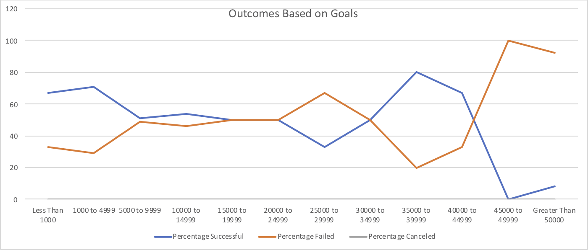
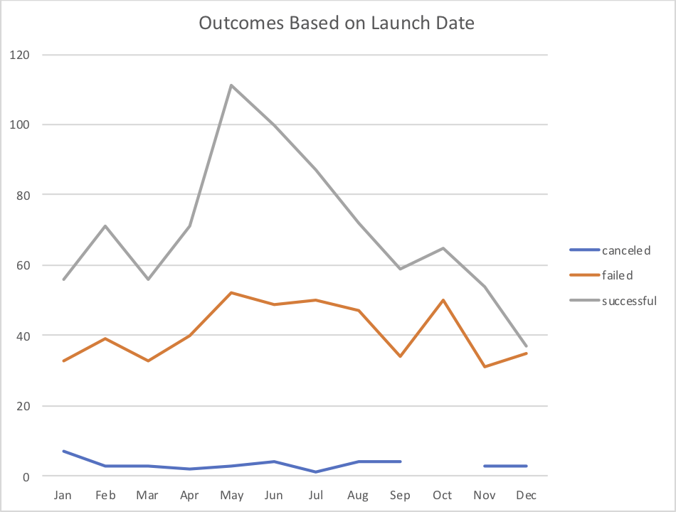
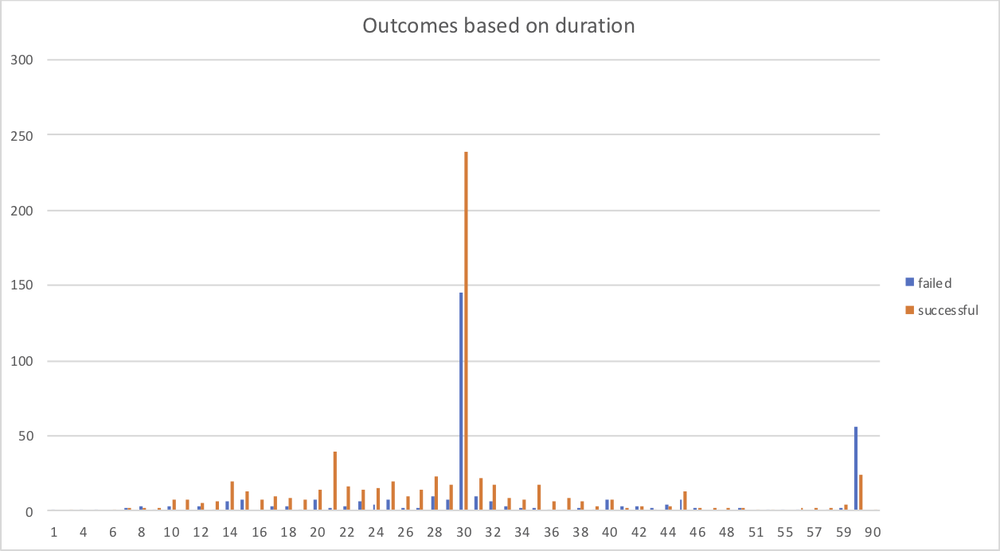

# An analysis on Kickstarter Campaigns
Performing analysis on Kickstarter data to uncover trends

Based on category based analysis Theatre campaigns had fair success compared to failures, please see the attached chart 

Also Theatre category had more success on May, June, July months so I would recommend doing on those months for better success for Louise Fever play 

Based on initial statement Luise was planning for a budget of 10K but based on successful theatre play the mean goal was around 5K and the median was 3K where as the failed theatre play had a mean goal of 10K and median was 5K, so I would recommend Luise to reduce the budget to be 5K to better make it successful play. Additional [Statistical Ananlysis](data-1-1-3-StarterBook.xlsx)

### Challenge
Based on analysis when the goal is below $ 5000, there were more number of plays and also the success seems to be close of 70%.

When the goal is in higher number like $35,000 - 39,999 even the success percentage is high we didn't have enough number of plays to support this holds true.

It would be ideal to launch the play during May and Jun where the success rate is double that of the failure.

Also duration seems to play a role in the success, on a average plays which played for a month had high success rate. This seems to be a optimum number of days anything more than this and/or less than this had more failures

